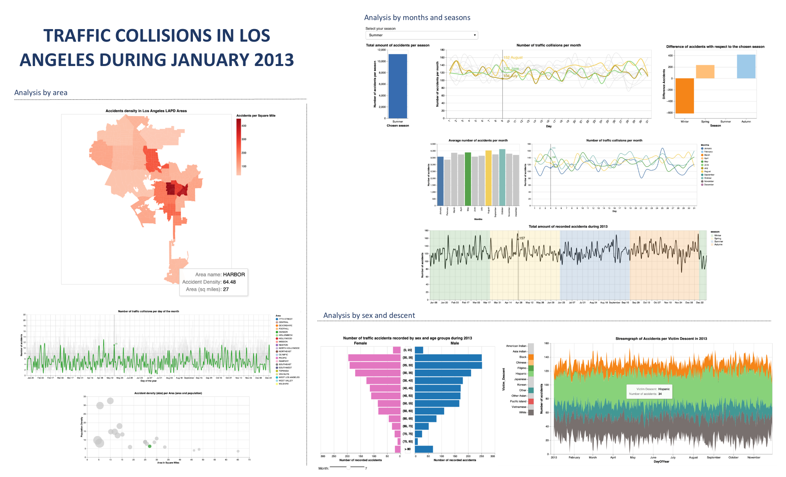

# Information Visualization lab (using Altair Python library)

## Introduction

The goal of the first visualization project was to create a visualization that analyzes the traffic collisions
happened in Los Angeles during a month of the period 2010-present, that can be obtained from the Kaggle
dataset: https://www.kaggle.com/cityofLA/los-angeles-traffic-collision-data.

The dataset contains information regarding several years that includes location, time, etc. You must select a
month, drop the rest of the data (you can do this pretty easily using Python), and create a visualization that is
able to answer the following questions:

- Are accidents more frequent during weekdays or weekends?
- How have the accidents evolved along the month?
- What time of the day are accidents more common?
- Are there any areas with larger amount of accidents?
- Is there a correlation between the weather conditions and accidents?

## Notebooks

- [**data_analysis.ipynb**](./data_analysis.ipynb): Notebook exploring data and creating visualizations to answer the stated questions
- [**data_analysis_interactive_charts.ipynb**](./interactive_chart_notebook.zip) : (*had to be zipped due to size limit*) Notebook exploring data and creating interactive visualizations to answer deeper questions.

## Result

The result of the project is a dashboard that can be found as PDF file in the repository. [Link](./data/Dashboard.pdf)

